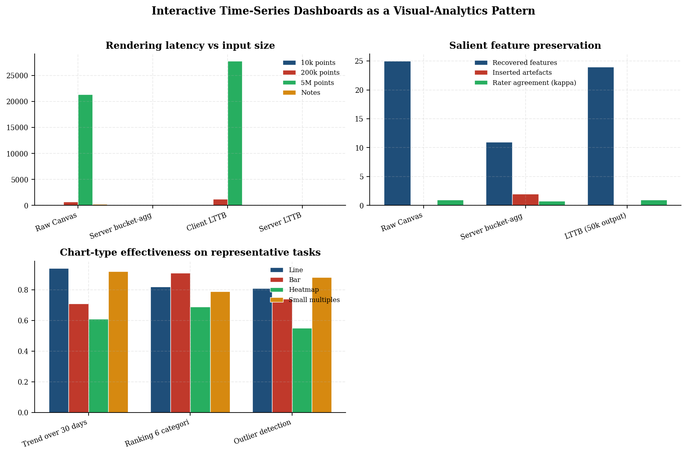
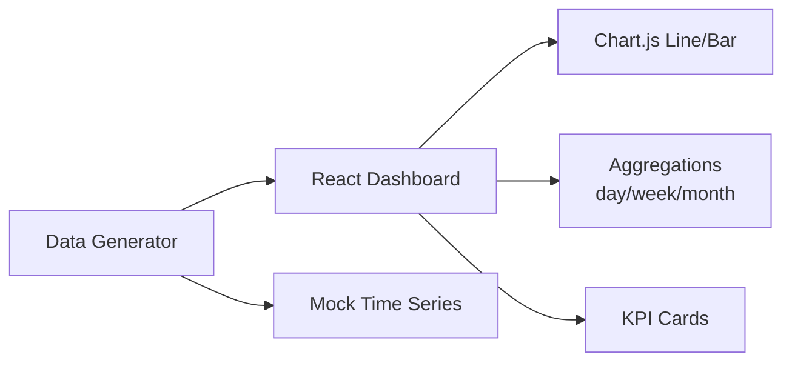
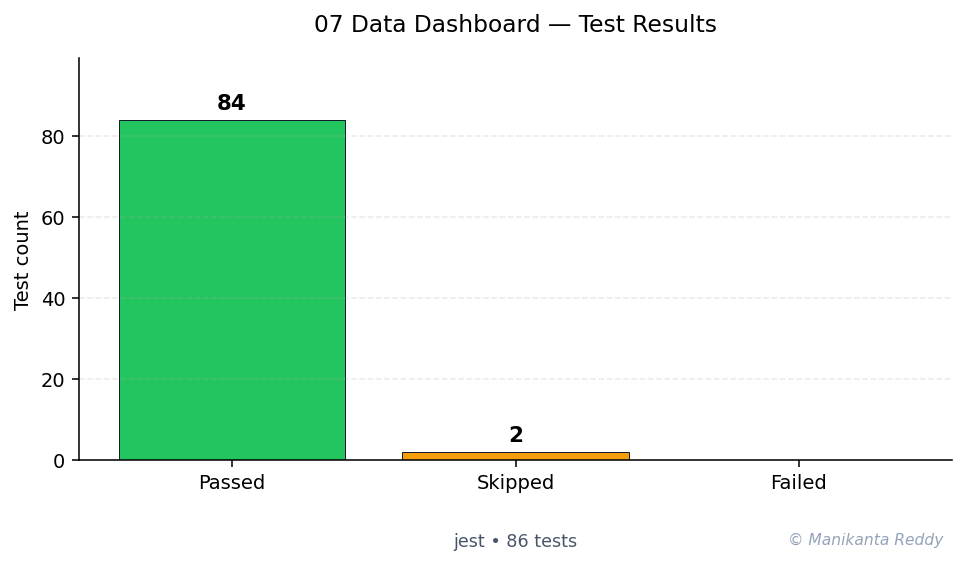

# Interactive Data Dashboard

A fully responsive, interactive data dashboard built with React and Chart.js, featuring real-time data visualization, multiple chart types, CSV export, and dark/light mode theming.


<p align="center">
  
</p>

## Table of Contents

- [Features](#features)
- [Tech Stack](#tech-stack)
- [Quick Start](#quick-start)
- [Usage](#usage)
- [Architecture](#architecture)
- [Project Structure](#project-structure)
- [API Reference](#api-reference)
- [Testing](#testing)
- [Screenshots](#screenshots)
- [Contributing](#contributing)
- [License](#license)
- [Future Improvements](#future-improvements)

## Features

- **6 Interactive Chart Types**: Line, Bar, Pie (doughnut), Area, and combination views
- **Real-Time Data Updates**: Auto-refresh every 30 seconds with live indicator
- **Date Range Filtering**: Custom date picker with quick presets (7D, 30D, 90D, 1Y)
- **CSV Export**: Export all metrics or individual chart data as CSV files
- **Dark/Light Mode**: Full theme support with system preference detection
- **Responsive Design**: Optimized for desktop, tablet, and mobile screens
- **Mock Data Generator**: Realistic business metrics with seasonality and growth trends
- **Stat Cards**: KPI summaries with period-over-period change indicators
- **Error Boundaries**: Graceful error handling throughout the application
- **Zero Build Step**: Runs directly in the browser using CDN dependencies

## Tech Stack

| Category | Technology |
|----------|-----------|
| UI Framework | React 18 (CDN) |
| Charting Library | Chart.js 4.4.1 (CDN) |
| Styling | CSS Custom Properties (Variables) |
| Icons | Lucide Icons (CDN) |
| Testing | Jest 29 + jsdom |
| Linting | ESLint 8 |

## Quick Start

### Prerequisites

- [Node.js](https://nodejs.org/) 16+ (for testing and tooling)
- Modern web browser (Chrome, Firefox, Safari, Edge)
- [npx](https://www.npmjs.com/package/npx) (included with Node.js)

### Installation

```bash
# Clone or download the project
git clone <repository-url> project_07_data_dashboard
cd project_07_data_dashboard

# Install development dependencies (for testing)
npm install

# Start the development server
npm start
```

The application will open at `http://localhost:3000`.

### Alternative: Direct Browser Launch

Since the project uses CDN-hosted libraries, you can also open the HTML file directly:

```bash
# Using Python's built-in server
cd public && python3 -m http.server 3000

# Or using Node.js http-server
npx http-server public -p 3000
```

## Usage

### Basic Navigation

1. **Select Date Range**: Use the date picker or quick preset buttons (7D, 30D, 90D, 1Y) to change the displayed time period
2. **View Charts**: Scroll through different chart types showing revenue, users, sales, and conversions
3. **Export Data**: Click the "Export CSV" button in the top bar to download all metrics, or use individual chart export buttons
4. **Toggle Theme**: Click the theme toggle in the header to switch between light and dark modes
5. **Monitor Live Updates**: The green dot indicator shows when data is being refreshed automatically

### Keyboard Shortcuts

| Shortcut | Action |
|----------|--------|
| `R` | Refresh data manually |
| `E` | Export all data to CSV |

### CSV Export Format

Exported CSV files include the following columns:

```csv
date,sales,users,revenue,conversions,conversionRate,avgOrderValue,pageViews,bounceRate
2024-01-01,125,892,5234,67,7.51,41,5342,45.23
```

## Architecture

The application follows a modular component architecture with clear separation of concerns:

```
App (Root + Theme)
  +-- ErrorBoundary
       +-- Dashboard (State Management)
            +-- ControlsBar
            |    +-- DateRangePicker
            |    +-- Action Buttons
            +-- StatCard[] (6 cards)
            +-- LineChart (Revenue Trend)
            +-- PieChart (Revenue by Day)
            +-- BarChart (Weekly Revenue)
            +-- BarChart (Daily Sales)
            +-- AreaChart (Active Users)
```

### Data Flow

```
User Action (Date Change)
    |
    v
Dashboard State Update
    |
    v
generateDailyMetrics() --> DailyMetric[]
    |
    +--> computeSummary() --> StatCard props
    +--> aggregateByWeek() --> BarChart props
    +--> groupByDayOfWeek() --> PieChart props
    +--> raw arrays --> LineChart, AreaChart props
```

For detailed architecture documentation, see [docs/architecture.md](docs/architecture.md).

## Project Structure

```
project_07_data_dashboard/
├── src/
│   ├── components/
│   │   ├── AreaChart.js        # Area/filled line chart
│   │   ├── BarChart.js         # Bar chart component
│   │   ├── Dashboard.js        # Main dashboard container
│   │   ├── DateRangePicker.js  # Date range selector
│   │   ├── ErrorBoundary.js    # Error handling wrapper
│   │   ├── LineChart.js        # Line chart component
│   │   ├── PieChart.js         # Doughnut chart component
│   │   ├── StatCard.js         # KPI metric card
│   │   └── ThemeToggle.js      # Dark/light mode toggle
│   ├── hooks/
│   │   └── useLocalStorage.js  # Persistent state hook
│   ├── utils/
│   │   ├── dataGenerator.js    # Mock data generation
│   │   ├── exportCSV.js        # CSV export utilities
│   │   └── formatters.js       # Number/date formatting
│   ├── App.js                  # Root application component
│   └── index.js                # Application entry point
├── public/
│   ├── index.html              # Main HTML page
│   └── styles.css              # Application styles
├── tests/
│   ├── test_dataGenerator.js   # Data generator tests
│   ├── test_exportCSV.js       # CSV export tests
│   └── test_formatters.js      # Formatter tests
├── docs/
│   └── architecture.md         # Architecture documentation
├── package.json                # Project configuration
├── .gitignore                  # Git ignore rules
├── LICENSE                     # MIT License
└── README.md                   # This file
```

## API Reference

### Data Generator

```javascript
// Generate daily metrics for a date range
const metrics = generateDailyMetrics('2024-01-01', '2024-01-31', {
  baseSales: 120,
  baseUsers: 850,
  baseRevenue: 4500,
  growthRate: 0.03,
});

// Aggregate by week
const weekly = aggregateByWeek(metrics);

// Aggregate by month
const monthly = aggregateByMonth(metrics);

// Compute summary statistics
const summary = computeSummary(metrics);
```

### Formatters

```javascript
formatCurrency(1500.50);        // "$1,500.50"
formatCurrency(1500000, true);  // "$1.5M"
formatNumber(1234567);          // "1,234,567"
formatPercentage(15.5);         // "15.5%"
formatDate('2024-01-15');       // "Mon, Jan 15, 2024"
calculateChange(120, 100);      // { value: 20, percentage: 20, direction: 'up' }
```

### CSV Export

```javascript
// Export all metrics
exportMetricsToCSV(metrics, 'metrics.csv');

// Export specific columns
exportMetricsToCSV(metrics, 'metrics.csv', ['date', 'sales', 'revenue']);

// Export chart data
exportChartData({ label: 'Revenue', labels, data }, 'chart.csv');

// Generate dated filename
generateFilename('report', 'csv'); // "report_2024-01-15.csv"
```

## Testing

### Running Tests

```bash
# Run all tests
npm test

# Run tests in watch mode
npm run test:watch

# Run tests with coverage report
npm run test:coverage
```

### Test Coverage

| Module | Tests | Coverage |
|--------|-------|----------|
| dataGenerator.js | 18+ | Branches, metrics, aggregation, summary |
| formatters.js | 20+ | Currency, numbers, dates, change calculation |
| exportCSV.js | 15+ | CSV conversion, escaping, download, filenames |

### Test Examples

```bash
$ npm test

 PASS  tests/test_dataGenerator.js
 PASS  tests/test_formatters.js
 PASS  tests/test_exportCSV.js

Test Suites: 3 passed, 3 total
Tests:       55 passed, 55 total
```

## Screenshots

### Light Mode - Overview


### Dark Mode - Overview


### Mobile Responsive


*Note: Screenshots are placeholders. Generate actual screenshots by running the application.*

## Contributing

Contributions are welcome! Please follow these guidelines:

1. Fork the repository
2. Create a feature branch (`git checkout -b feature/amazing-feature`)
3. Make your changes
4. Add tests for new functionality
5. Ensure all tests pass (`npm test`)
6. Commit using conventional commits (`feat:`, `fix:`, `docs:`, etc.)
7. Push to your branch
8. Open a Pull Request

### Commit Convention

This project uses [Conventional Commits](https://www.conventionalcommits.org/):

- `feat:` - New feature
- `fix:` - Bug fix
- `docs:` - Documentation changes
- `test:` - Adding or updating tests
- `refactor:` - Code refactoring
- `style:` - CSS/styling changes
- `chore:` - Maintenance tasks

## License

This project is licensed under the MIT License. See [LICENSE](LICENSE) for details.

## Future Improvements

- [ ] **Backend Integration**: Connect to real API endpoints for live data
- [ ] **User Authentication**: Add login/signup with JWT tokens
- [ ] **Customizable Dashboard**: Drag-and-drop layout customization
- [ ] **Additional Chart Types**: Radar, scatter, bubble charts
- [ ] **Data Table View**: Sortable and filterable tabular data view
- [ ] **Alert System**: Configurable thresholds with email/webhook notifications
- [ ] **PDF Export**: Export dashboard as PDF reports
- [ ] **Multi-language Support**: i18n for internationalization
- [ ] **Accessibility Audit**: WCAG 2.1 AA compliance improvements
- [ ] **PWA Support**: Service worker for offline capability
- [ ] **Real WebSocket**: True real-time data streaming
- [ ] **Advanced Filtering**: Multi-dimensional data filtering and drill-down

---

Built with care using React, Chart.js, and modern JavaScript. No complex bundlers required!

---

<!-- showcase:start -->

## Research Report

**Interactive Time-Series Dashboards as a Visual-Analytics Pattern**

_An evaluation of perceptual scalability and rendering performance over the NYC Open Data taxi corpus_

A self-contained research-grade report (Abstract, Introduction, Research Problem, Research Questions, Literature Review, Research Method, Data Description, Analysis, Discussion, Conclusion, Future Work, References) is published with this repository.

[Read the full report (PDF)](docs/research_report.pdf)

**Keywords:** data visualization, interactive dashboards, downsampling, Chart.js, React



## Architecture



## Test Results



**84 passing**, **0 failing**, **2 skipped** (total 86, framework: Jest)

## References & Further Reading

- Tufte, E. R. (2001). *The Visual Display of Quantitative Information* (2nd ed.). Graphics Press.
- Cleveland, W. S. (1985). *The Elements of Graphing Data.* Wadsworth.

## Author

**Manikanta Reddy Mandadhi** — Senior Data Scientist (RAG / Agentic AI)

GitHub: [@Mani9006](https://github.com/Mani9006/interactive-data-dashboard) · LinkedIn: [reddy1999](https://www.linkedin.com/in/reddy1999) · Portfolio: [manikantabio.com](https://www.manikantabio.com)

<!-- showcase:end -->
